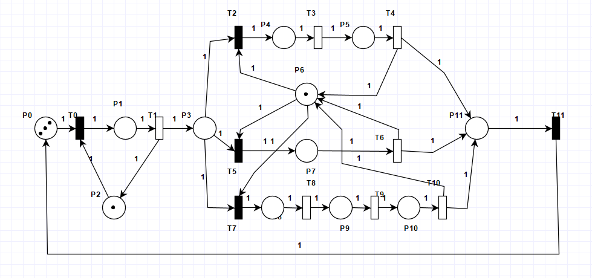
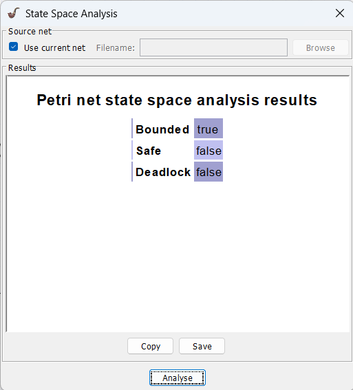
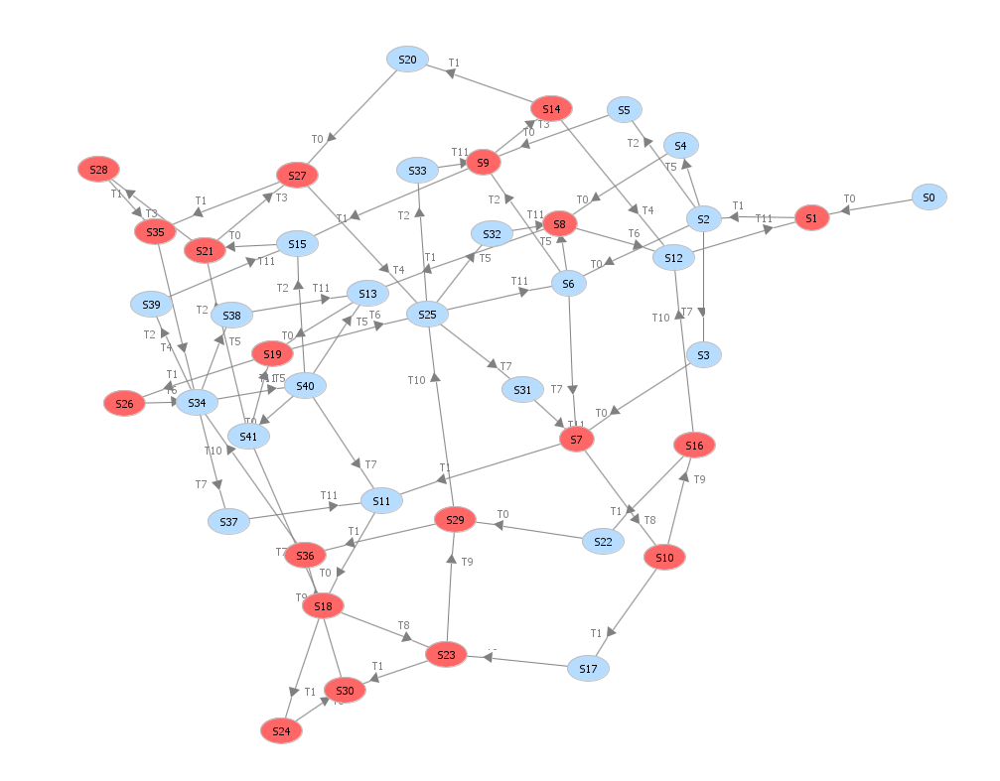
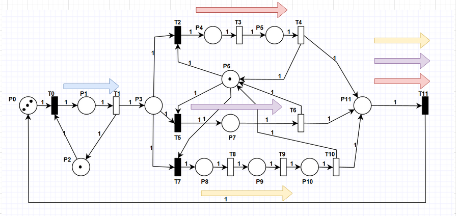
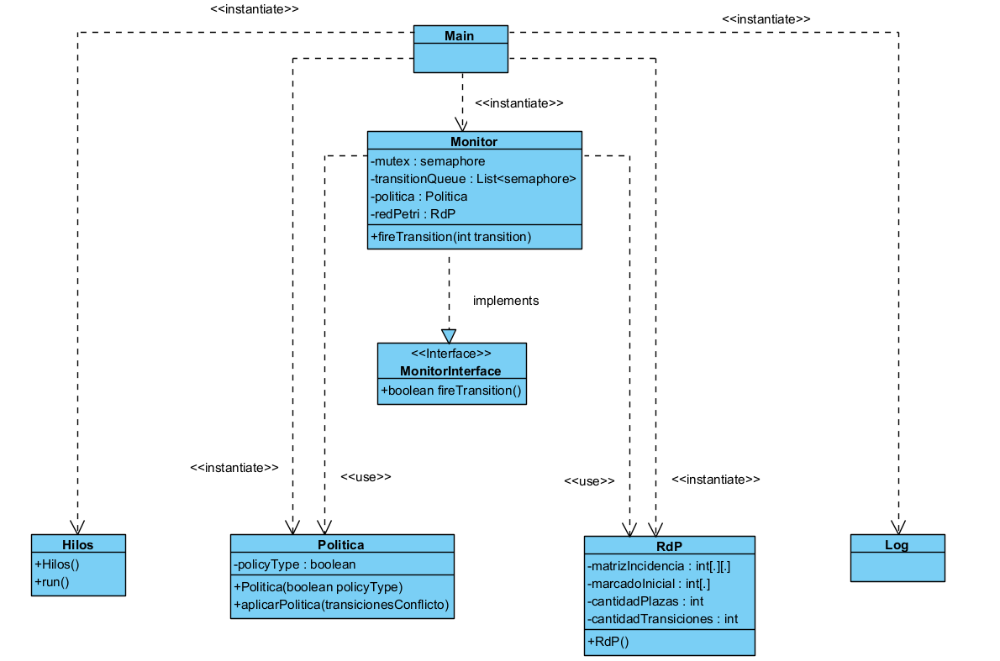
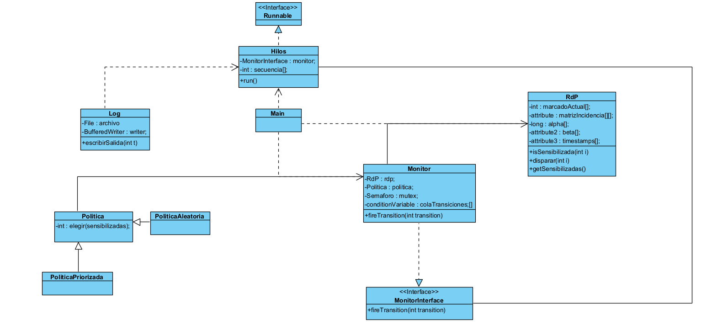
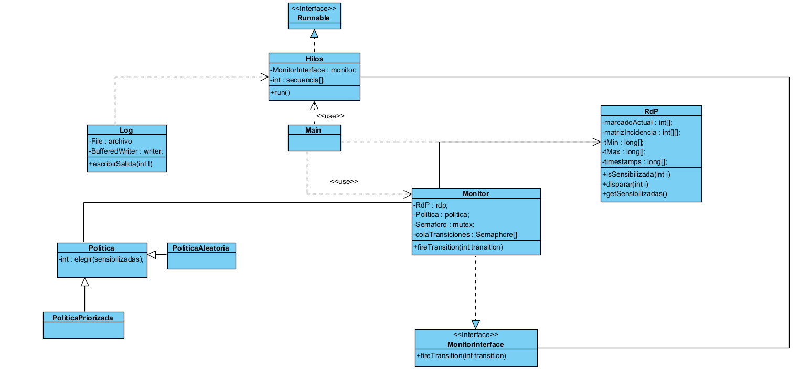

# Informe - Tp2

## Consignas a Responder
1) Es necesario determinar con PIPE las propiedades de la red (deadlock, vivacidad, seguridad).
2) Indicar cuál o cuáles son los invariantes de plaza y los invariantes de transición de la red. Realizar una breve descripción de lo que representan en el modelo.
3) Realizar una tabla, con los estados del sistema.
4) Realizar una tabla, con los eventos del sistema.
5) Determinar la cantidad de hilos necesarios para la ejecución del sistema con el mayor paralelismo posible 
   -  Caso 1: si el invariante de transición tiene un conflicto, con otro invariante, debe haber un hilo encargado de la ejecución de la/s transición/es anterior/es al conflicto y luego un hilo por invariante.
   -  Caso 2: si el invariante de transición presenta un join, con otro invariante de transición, luego del join debe haber tantos hilos, como tokens simultáneos en la plaza, encargados de las transiciones restantes dado que hay un solo camino.

6) Hacer el diagrama de clases que modele el sistema.
7) Hacer el diagrama de secuencia que muestre el disparo exitoso de una transición que esté sensibilizada, mostrando el uso de la política.

**La red en cuestion a analizar es:**

## Respuestas
1) Luego de aplicar un análisis con el software PIPE, podemos determinar las siguientes propiedades de la red:
   - **Es una red sin deadlock**. Esto es de gran importancia ya que siempre existe una transicion habilitada y por ende el sistema puede seguir evolucionando. En otras palabras, no existe ninguna marcacion alcanzable en la que todas las transiciones esten deshabilitadas.
   - **No es una red segura**. Existe alguna plaza con mas de 1 token alcanzable en alguna marcacion.
   - **Es una red acotada**. Ninguna plaza puede tener mas de *k* tokens, en cualquier estado alcanzable.
   - **Es una red Viva**. Desde cualquier estado alcanzable, existe alguna secuencia futura de disparos que permite activarla.

   

2) Las ecuaciones de los invariantes de plaza son:
   $$M(P0) + M(P1) + M(P3) + M(P4) + M(P5) + M(P7) + M(P8) + M(P9) + M(P10) + M(P11) = 3$$
   $$M(P1) + M(P2) = 1$$
   $$M(P10) + M(P4) + M(P5) + M(P6) + M(P7) + M(P8) + M(P9) = 1$$

   Los **invariantes de plaza** en RdP son combinaciones lineales de plazas cuyas suma de tokens se mantiene constante para cualquier evolucion de la red. Representan la conservacion de recursos y flujo del sistema.

   Y las invariantes de transición son:
      - T0 -> T1 -> T2 -> T3 -> T4 -> T11
   
      - T0 -> T1 -> T5 -> T6 -> T11
   
      - T0 -> T1 -> T7 -> T8 -> T9 -> T10 -> T11
   
   Los **invariantes de transicion** son secuencias de disparos de transiciones que dejan la red en la misma marcacion inicial.

   La red de petri modelada representa un sistema de procesamiento de datos con recursos compartidos (los que se encuentran en P2 y P6). Los datos entran a una cola (P0), pasan a un buffer de entrada (P3) mediante un bus compartido (P2), y son procesados por una unidad compartida (P6) en tres modos:
   - simple (P7)
   - medio (P4-P5) 
   - alto (P8-P9-P10)

3) Tabla de estados del sistema

   | Estado | Marcado                   | Transición disparada  | Transiciones habilitadas |
   |--------|---------------------------|-----------------------|--------------------------|    
   | S0     | **[3 0 0 0 1 0 0 0 1 0 0 0]** | -                 | T0                       |
   | S1     | **[2 1 0 0 0 0 0 0 1 0 0 0]** | T0, T11           | T1                       |
   | S2     | **[2 0 0 0 1 1 0 0 1 0 0 0]** | T1                | T0,T2,T5,T7              |
   | S3     | **[2 0 0 0 1 0 0 0 0 0 1 0]** | T7                | T0                       |
   | S4     | **[2 0 0 0 1 0 0 0 0 1 0 0]** | T5                | T0                       |
   | S5     | **[2 0 0 0 1 0 1 0 0 0 0 0]** | T2                | T0                       |
   | S6     | **[1 1 0 0 0 1 0 0 1 0 0 0]** | T0, T11           | T2, T5, T7               |
   | S7     | **[1 1 0 0 0 0 0 0 0 0 1 0]** | T0, T7, T11       | T8, T1                   |
   | S8     | **[1 1 0 0 0 0 0 0 0 1 0 0]** | T0, T5, T11       | T6, T1                   |
   | S9     | **[1 1 0 0 0 0 1 0 0 0 0 0]** | T0, T2, T11       | T3, T1                   |
   | S10    | **[1 1 0 0 0 0 0 0 0 0 0 1]** | T8                | T9, T1                   |
   | S11    | **[1 0 0 0 1 1 0 0 0 0 1 0]** | T1, T11, T7       | T0                       |
   | S12    | **[1 1 0 1 0 0 0 0 1 0 0 0]** | T6, T4, T1        | T11                      |
   | S13    | **[1 0 0 0 1 1 0 0 0 1 0 0]** | T1, T11, T5       | T0                       |
   | S14    | **[1 1 0 0 0 0 0 1 0 0 0 0]** | T3                | T4, T1                   |
   | S15    | **[1 0 0 0 1 1 1 0 0 0 0 0]** | T1, T11, T2       | T0                       |
   | S16    | **[1 1 1 0 0 0 0 0 0 0 0 0]** | T9                | T10, T1                  |
   | S17    | **[1 0 0 0 1 1 0 0 0 0 0 1]** | T1                | T0                       |
   | S18    | **[0 1 0 0 0 1 0 0 0 0 1 0]** | T0, T7            | T8, T1                   |
   | S19    | **[0 1 0 0 0 1 0 0 0 1 0 0]** | T0, T5            | T6, T1                   |
   | S20    | **[1 0 0 0 1 1 0 1 0 0 0 0]** | T1                | T0                       |
   | S21    | **[0 1 0 0 0 1 1 0 0 0 0 0]** | T0, T2            | T3, T1                   |
   | S22    | **[1 0 1 0 1 1 0 0 0 0 0 0]** | T1                | T0                       |
   | S23    | **[0 1 0 0 0 1 0 0 0 0 0 1]** | T0, T8            | T9, T1                   |
   | S24    | **[0 0 0 0 1 2 0 0 0 0 1 0]** | T1                | T8                       |
   | S25    | **[0 1 0 1 0 1 0 0 1 0 0 0]** | T6, T4, T10       | T7, T5, T2, T11          |
   | S26    | **[0 0 0 0 1 2 0 0 0 1 0 0]** | T1                | T6                       |
   | S27    | **[0 1 0 0 0 1 0 1 0 0 0 0]** | T0, T3            | T4, T1                   |
   | S28    | **[0 0 0 0 1 2 1 0 0 0 0 0]** | T1                | T3                       |
   | S29    | **[0 1 1 0 0 1 0 0 0 0 0 0]** | T0, T9            | T10, T1                  |
   | S30    | **[0 0 0 0 1 2 0 0 0 0 0 1]** | T1, T8            | T9                       |
   | S31    | **[0 1 0 1 0 0 0 0 0 0 1 0]** | T7                | T11                      |
   | S32    | **[0 1 0 1 0 0 0 0 0 1 0 0]** | T5                | T11                      |
   | S33    | **[0 1 0 1 0 0 1 0 0 0 0 0]** | T2                | T11                      |
   | S34    | **[0 0 0 1 1 2 0 0 1 0 0 0]** | T6, T4, T10       | T7, T5, T2, T11          |
   | S35    | **[0 0 0 0 1 2 0 1 0 0 0 0]** | T1, T3            | T4                       |
   | S36    | **[0 0 1 0 1 2 0 0 0 0 0 0]** | T1, T9            | T10                      |
   | S37    | **[0 0 0 1 1 1 0 0 0 0 1 0]** | T7                | T11                      |
   | S38    | **[0 0 0 1 1 1 0 0 0 1 0 0]** | T5                | T11                      |
   | S39    | **[0 0 0 1 1 1 1 0 0 0 0 0]** | T2                | T11                      |
   | S40    | **[1 0 0 0 1 2 0 0 1 0 0 0]** | T11               | T7, T5, T2, T0           |
   | S41    | **[0 1 0 0 0 2 0 0 1 0 0 0]** | T0                | T7, T5, T2               |

      

4) Tabla de eventos del sistema

 | Transicion | Descripcion |
 |------------|-------------|
 | T0 | Llegada de un dato al sistema |
 | T1 | Transferencia del dato al buffer de procesamiento usando el recurso compartido |
 | T2 | Transferencia del dato al buffer de procesamiento usando el recurso compartido |
 | T3 | Avance a la segunda etapa del procesamiento medio |
 | T4 | Finalización del procesamiento medio y liberación del recurso |
 | T5 | Inicio de procesamiento de complejidad simple |
 | T6 | Finalización del procesamiento simple y envío a salida |
 | T7 | Inicio de procesamiento de complejidad alta |
 | T8 | Primera etapa del procesamiento alto |
 | T9 | Segunda etapa del procesamiento alto |
 | T10 | Finalización del procesamiento alto y envío a salida |
 | T11 | Salida del dato procesado y retorno al sistema |

Los eventos representan las distintas etapas del procesamiento de datos dentro del sistema, incluyendo la asignación de recursos compartidos y los diferentes niveles de complejidad de procesamiento.

5) Analizando nuestra red, podemos observar que primero tenemos un comportamiento secuencial, dado que las transiciónes:
   - T0, T1 se comparten entre las 3 invariantes de transición
   
   Luego de esto, tenemos un conflicto en la P3, ya que, las transiciónes T2,T5,T7 compiten por el recurso que tenemos en P6. Siguiendo con las recomendaciones del caso 1, necesitamos un hilo antes del conflicto y otros 3 hilos después del conflicto debido a que tenemos 3 invariantes. Lo que nos dá un total de 4 hilos.

   Al final tenemos un Join, pero esto no genera problema debido a que los mismos 3 hilos que llevaron el token a la P11 pueden disparar la transición T11 para así devolverlos a P0.

   

6) Nuestro primer diagrama de clases fue:

   

   Segundo diagrama de clases:

   

   Diagrama actualizado:

   